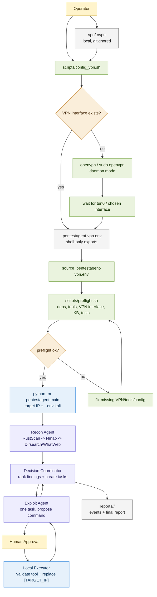

# ADR-04: Shell-Owned VPN Setup and No Python Network Layer

Date: 2026-06-03

Status: Proposed

## Context

Kali/HTB runs need the VM to establish a VPN route before scanning a target. Starting OpenVPN, checking Linux interfaces, using `sudo`, and managing routes are operating-system concerns. They are easier to inspect and debug in shell scripts.

The Python agent does not need to configure networking. For v1 it only needs a target IP. Once the VPN route exists, tools such as RustScan, Nmap, Dirsearch, WhatWeb, curl, searchsploit, and msfconsole use the operating system route table.

We briefly considered a Python `pentestagent/networking/` package for VPN/LHOST placeholder context, but that adds another layer without a current runtime need.

## Decision

Remove the Python networking package and related runtime config.

The project will not keep:

- `pentestagent/networking/`;
- `network:` settings in YAML config;
- `PENTEST_VPN_INTERFACE`, `PENTEST_LHOST`, or `PENTEST_REQUIRE_VPN_INTERFACE` in `.env.example`;
- `[LHOST]` or `[VPN_INTERFACE]` placeholder handling in the Python executor;
- LHOST/VPN context in LLM payloads.

VPN setup belongs to shell scripts.

The project will provide `scripts/config_vpn.sh` as a thin Kali helper:

- accepts an `.ovpn` profile path and an optional interface name;
- starts OpenVPN when the interface is not already present, using direct `openvpn` as root or `sudo openvpn` as a non-root user;
- waits for the expected interface;
- resolves the interface IPv4 address;
- writes `.pentestagent-vpn.env` for shell/preflight visibility.

The operator flow is:

```bash
./scripts/config_vpn.sh vpn/machines_us-3.ovpn tun0
source .pentestagent-vpn.env
./scripts/preflight.sh
uv run python -m pentestagent.main -t <TARGET_IP> --env kali
```

The Python agent continues to replace only `[TARGET_IP]` inside approved command proposals.

## Workflow Diagram



The important boundary is that `scripts/config_vpn.sh` and `scripts/preflight.sh` may inspect or prepare the host environment, while `pentestagent.main` only runs the agent workflow against a target reachable through the operating system route table.

## VPN Profile Location

Local VPN profiles should go under:

```text
vpn/
└── <profile>.ovpn
```

`vpn/` exists as a local input directory. `.ovpn` files and generated VPN env files are gitignored.

For a future "upload `.ovpn` + target IP and finish the HTB box" workflow, the upload path should be:

1. save the uploaded `.ovpn` into `vpn/`;
2. call `scripts/config_vpn.sh vpn/<uploaded>.ovpn tun0`;
3. source `.pentestagent-vpn.env`;
4. run `uv run python -m pentestagent.main -t <TARGET_IP> --env kali`.

That future wrapper can be another shell script. It should not move VPN setup into Python.

## Local Docker Kali Testing Workflow

For local Mac/Docker Desktop testing, use the Compose-managed Kali container. The image is defined by `docker/Dockerfile.kali-local` and supports both arm64 and x86_64 Docker hosts.

Start or rebuild the local Kali box:

```bash
docker compose up -d --build
docker compose ps
```

SSH into the container over the localhost-only port:

```bash
ssh -p 2222 root@localhost
# password: kali
cd /app
```

The project root is already mounted into the container:

```yaml
volumes:
  - ./:/app
```

That means normal development and testing do not need `scp`. All files from the repository root on the host are visible at `/app` inside Kali, and edits on the host appear there immediately. Prefer this mounted `/app` workflow for scripts, Python package code, configs, docs, wordlists, and generated reports.

The live agent uses the mounted prebuilt Chroma store at `/app/my_knowledge_base` when RAG context is available. It does not run the crawler or preprocessing files under `/app/crawled-data/tmp` during target testing; those files are development tooling for preparing knowledge-base content.

Use `scp` only for one-off files that should not live in the repository root:

```bash
scp -P 2222 path/to/local-file root@localhost:/root/
```

The expected container-side test flow is:

```bash
cd /app
uv sync --group dev
ENV=kali source scripts/config_secrets.sh
./scripts/config_vpn.sh vpn/<profile>.ovpn tun0
source .pentestagent-vpn.env
./scripts/preflight.sh
uv run python -m pentestagent.main -t <TARGET_IP> --env kali
```

`scripts/config_secrets.sh` must be sourced because a normal executed script cannot export variables back into the parent shell. It prompts with hidden input for API keys, exports only into the current shell, and does not write secrets to disk.

For Kali/HTB runs, preflight should run after both secret exports and VPN exports are present in the shell. The order is: source `scripts/config_secrets.sh`, run `scripts/config_vpn.sh`, source `.pentestagent-vpn.env`, then run `scripts/preflight.sh`.

LangSmith Cloud tracing is optional. When enabled, traces can include prompts, recon summaries, command proposals, and selected command output excerpts. Leave `LANGSMITH_TRACING` unset or `false` for runs that must stay local-only.

If the VPN profile should be read from outside `/app`, mount it explicitly in `docker-compose.yml`, for example `./vpn/lab.ovpn:/root/lab.ovpn:ro`, then run `./scripts/config_vpn.sh /root/lab.ovpn tun0` inside the container.

## Local Docker Troubleshooting

`VPN config not found: /app/machines_us-3.ovpn` means the script was given a path that does not exist inside the container. The Compose workflow mounts the repository root at `/app`, so a profile stored at `vpn/machines_us-3.ovpn` on the host should be referenced inside Kali as:

```bash
./scripts/config_vpn.sh vpn/machines_us-3.ovpn tun0
```

`sudo: command not found` means the script is running inside the minimal Docker Kali image as `root`. In that shell, `sudo` is unnecessary. `scripts/config_vpn.sh` should call `openvpn` directly when `id -u` is `0`, and only call `sudo openvpn` for non-root VM shells.

If this appears:

```text
bash: warning: setlocale: LC_ALL: cannot change locale (en_US.UTF-8): No such file or directory
```

the running container was built before locale generation was added to `docker/Dockerfile.kali-local`. It is only a warning. Rebuild and recreate the container to remove it:

```bash
docker compose up -d --build --force-recreate kali
```

`WARNING: REMOTE HOST IDENTIFICATION HAS CHANGED!` after rebuilding or recreating the container means SSH still has the previous container's host key recorded for `localhost:2222`. This is expected for the local throwaway Docker lab because the container generates fresh SSH host keys. Remove only the stale localhost entry, then connect again:

```bash
ssh-keygen -R '[localhost]:2222'
ssh -p 2222 root@localhost
```

For a real remote host, investigate before removing a known-hosts entry. For this local Docker lab, the changed key is normal after image rebuilds or container recreation.

If preflight prints optional-tool warnings for `searchsploit` or `msfconsole`, the agent can still start. These tools are allowlisted because the LLM may propose them, but v1 does not require them for recon. To install them inside the local Kali container:

```bash
apt-get update
apt-get install -y exploitdb metasploit-framework
```

`exploitdb` provides `searchsploit`; `metasploit-framework` provides `msfconsole`. On a normal Kali VM user shell, prefix those commands with `sudo`. To bake them into the local Docker image, uncomment the optional heavy-tools install block in `docker/Dockerfile.kali-local` and rebuild the container.

If apt prints `E: Unable to locate package exploitdb`, first refresh the apt package index. On a normal Kali VM user shell:

```bash
sudo apt-get update
sudo apt-get install -y exploitdb metasploit-framework
```

Inside the local Docker Kali container, the shell runs as `root`, so use:

```bash
apt-get update
apt-get install -y exploitdb metasploit-framework
```

If the terminal stops showing typed characters after interrupting a hidden secret prompt, reset the terminal:

```bash
stty sane
```

`scripts/config_secrets.sh` uses the shell's silent `read` path for Bash/Zsh so Ctrl+C should restore the terminal cleanly, but `stty sane` is the recovery command for any shell left in no-echo mode.

## Consequences

Positive:

- Python stays smaller and easier to maintain.
- VPN behavior remains visible shell behavior instead of hidden agent behavior.
- There is one source of truth for VPN setup: `scripts/config_vpn.sh`.
- The executor remains simple: structured args plus `[TARGET_IP]` replacement only.

Negative:

- Reverse-shell callback configuration is not modeled in v1.
- Future interactive exploitation or listener orchestration will need a separate ADR.
- The operator must run and source the shell VPN helper before Kali runs.

## Guardrails

- Do not add network-management subprocess calls to Python agent code.
- Do not let LLM agents choose or mutate VPN configuration.
- Do not commit `.ovpn` files or generated VPN env files.
- Keep first live runs behind human command approval.

## Validation

Static checks:

```bash
bash -n scripts/config_vpn.sh
bash -n scripts/config_secrets.sh
bash -n scripts/preflight.sh
UV_CACHE_DIR=.uv-cache uv run pytest -q
```

Kali runtime check:

```bash
./scripts/config_vpn.sh vpn/machines_us-3.ovpn tun0
source .pentestagent-vpn.env
./scripts/preflight.sh
```
