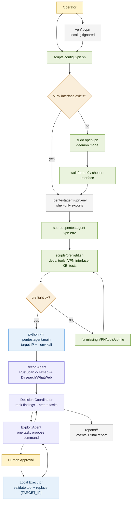

# ADR-04: Shell-Owned VPN Setup and No Python Network Layer

Date: 2026-06-03

Status: Proposed

## Context

Kali/HTB runs need the VM to establish a VPN route before scanning a target. Starting OpenVPN, checking Linux interfaces, using `sudo`, and managing routes are operating-system concerns. They are easier to inspect and debug in shell scripts.

The Python agent does not need to configure networking. For v1 it only needs a target IP. Once the VPN route exists, tools such as RustScan, Nmap, Dirsearch, WhatWeb, curl, searchsploit, and msfconsole use the operating system route table.

We briefly considered a Python `pentestagent/networking/` package for VPN/LHOST placeholder context, but that adds another layer without a current runtime need.

## Decision

Remove the Python networking package and related runtime config.

The project will not keep:

- `pentestagent/networking/`;
- `network:` settings in YAML config;
- `PENTEST_VPN_INTERFACE`, `PENTEST_LHOST`, or `PENTEST_REQUIRE_VPN_INTERFACE` in `.env.example`;
- `[LHOST]` or `[VPN_INTERFACE]` placeholder handling in the Python executor;
- LHOST/VPN context in LLM payloads.

VPN setup belongs to shell scripts.

The project will provide `scripts/config_vpn.sh` as a thin Kali helper:

- accepts an `.ovpn` profile path and an optional interface name;
- starts OpenVPN with `sudo openvpn` only when the interface is not already present;
- waits for the expected interface;
- resolves the interface IPv4 address;
- writes `.pentestagent-vpn.env` for shell/preflight visibility.

The operator flow is:

```bash
./scripts/config_vpn.sh vpn/machines_us-3.ovpn tun0
source .pentestagent-vpn.env
./scripts/preflight.sh
uv run python -m pentestagent.main -t <TARGET_IP> --env kali
```

The Python agent continues to replace only `[TARGET_IP]` inside approved command proposals.

## Workflow Diagram



The important boundary is that `scripts/config_vpn.sh` and `scripts/preflight.sh` may inspect or prepare the host environment, while `pentestagent.main` only runs the agent workflow against a target reachable through the operating system route table.

## VPN Profile Location

Local VPN profiles should go under:

```text
vpn/
└── <profile>.ovpn
```

`vpn/` exists as a local input directory. `.ovpn` files and generated VPN env files are gitignored.

For a future "upload `.ovpn` + target IP and finish the HTB box" workflow, the upload path should be:

1. save the uploaded `.ovpn` into `vpn/`;
2. call `scripts/config_vpn.sh vpn/<uploaded>.ovpn tun0`;
3. source `.pentestagent-vpn.env`;
4. run `uv run python -m pentestagent.main -t <TARGET_IP> --env kali`.

That future wrapper can be another shell script. It should not move VPN setup into Python.

## Consequences

Positive:

- Python stays smaller and easier to maintain.
- VPN behavior remains visible shell behavior instead of hidden agent behavior.
- There is one source of truth for VPN setup: `scripts/config_vpn.sh`.
- The executor remains simple: structured args plus `[TARGET_IP]` replacement only.

Negative:

- Reverse-shell callback configuration is not modeled in v1.
- Future interactive exploitation or listener orchestration will need a separate ADR.
- The operator must run and source the shell VPN helper before Kali runs.

## Guardrails

- Do not add network-management subprocess calls to Python agent code.
- Do not let LLM agents choose or mutate VPN configuration.
- Do not commit `.ovpn` files or generated VPN env files.
- Keep first live runs behind human command approval.

## Validation

Static checks:

```bash
bash -n scripts/config_vpn.sh
bash -n scripts/preflight.sh
UV_CACHE_DIR=.uv-cache uv run pytest -q
```

Kali runtime check:

```bash
./scripts/config_vpn.sh vpn/machines_us-3.ovpn tun0
source .pentestagent-vpn.env
./scripts/preflight.sh
```
